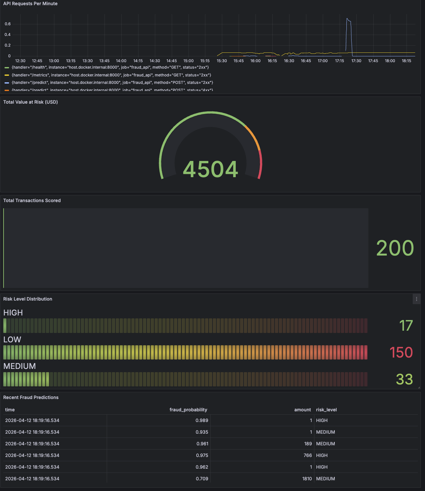
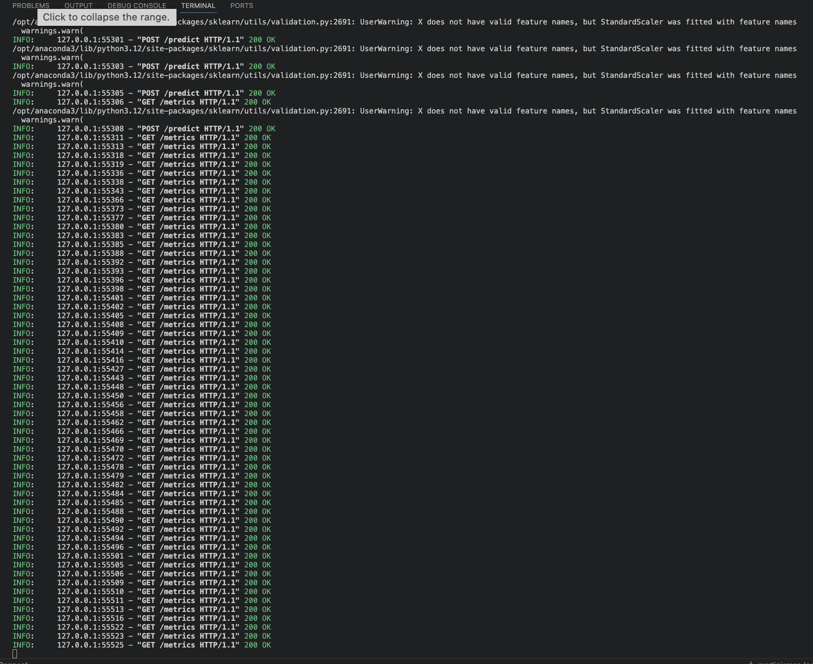
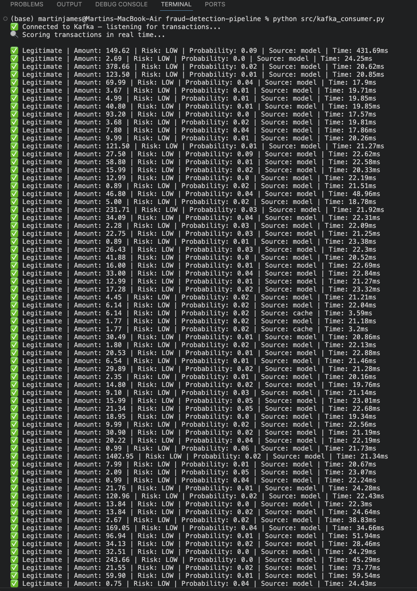

# Week 2 — Real-Time Credit Card Fraud Detection Pipeline

**Author:** Martin James Ng'ang'a | github.com/M20Jay  
**Status:** ✅ Week 2 Complete — Grafana Dashboard Live  
**Stack:** LightGBM · XGBoost · ADASYN · sklearn Pipeline · FastAPI · PostgreSQL · Redis · Kafka · Prometheus · Grafana · Docker

---

## Business Problem

A bank loses money every time a fraudulent transaction goes undetected.  
This pipeline scores every transaction in real time and flags fraud before it completes.  
Target: under 200ms per transaction. Achieved: 22ms average response time.

---

## Live API

🌐 [Interactive Docs](https://fraud-detection-pipeline-nznd.onrender.com/docs)

---

## Architecture

    creditcard.csv (284,807 transactions)
          ↓
    fraud_raw table (PostgreSQL)
          ↓
    ADASYN balancing → 4 Models trained → LightGBM selected (best PR-AUC)
          ↓
    fraud_pipeline.pkl saved
          ↓
    FastAPI (:8000) scores transactions in real time
          ↓
    Redis (:6379) caches predictions (300s TTL)
          ↓
    Kafka producer → Kafka consumer (streaming pipeline)
          ↓
    fraud_predictions table (PostgreSQL) — 200 predictions stored
          ↓
    Prometheus (:9090) scrapes /metrics every 15s
          ↓
    Grafana (:3000) — 5-panel live monitoring dashboard

---

## Project Structure

    fraud-detection-pipeline/
    ├── data/                        # creditcard.csv (gitignored)
    ├── screenshots/                 # Day screenshots
    │   ├── day4_fastapi.png
    │   ├── day4_producer.png
    │   ├── day4_consumer.png
    │   └── day5_grafana.png
    ├── notebooks/
    │   ├── 01_EDA_and_Feature_Engineering.ipynb
    │   └── 02_Preprocessing_and_Modelling.ipynb
    ├── sql/                         # Table definitions
    ├── src/
    │   ├── app.py                   # FastAPI + Redis + PostgreSQL
    │   ├── kafka_producer.py        # Streams transactions to Kafka
    │   ├── kafka_consumer.py        # Consumes and scores transactions
    │   └── load_raw_data.py         # Loads creditcard.csv → PostgreSQL
    ├── .python-version              # Python 3.11.9
    ├── docker-compose.yml           # All 6 services
    ├── prometheus.yml               # Prometheus scrape config
    └── README.md

---

## Services

| Service    | Port | Purpose                              |
|------------|------|--------------------------------------|
| PostgreSQL | 5433 | Stores raw data and all predictions  |
| Redis      | 6379 | Caches predictions (300s TTL)        |
| Kafka      | 9092 | Streaming transaction pipeline       |
| Zookeeper  | 2181 | Kafka coordination                   |
| Prometheus | 9090 | Scrapes FastAPI metrics every 15s    |
| Grafana    | 3000 | Live dashboard — 5 panels            |

---

## How to Run

    # 1. Start all Docker services
    docker compose up -d

    # 2. Kill local postgres if port conflict
    sudo pkill -u martinjames postgres

    # 3. Start FastAPI (Terminal 1)
    uvicorn src.app:app --reload --port 8000

    # 4. Start Kafka producer (Terminal 2)
    python src/kafka_producer.py

    # 5. Start Kafka consumer (Terminal 3)
    python src/kafka_consumer.py

---

## Progress

| Day   | Task                                            | Status       |
|-------|-------------------------------------------------|--------------|
| Day 1 | EDA + Feature Engineering                       | ✅ Complete  |
| Day 2 | ADASYN + 4 Models + LightGBM Pipeline saved     | ✅ Complete  |
| Day 3 | FastAPI + Redis caching + Prometheus            | ✅ Complete  |
| Day 4 | Kafka producer + consumer — real time streaming | ✅ Complete  |
| Day 5 | Grafana dashboard — 5 panels live               | ✅ Complete  |
| Day 6 | Business impact analysis                        | ✅ Complete  |
| Day 7 | Deploy to Render                                | ✅ Complete  |

---

## Day 6 — Business Impact Analysis

> SQL analysis run against 200 live predictions scored by the fraud detection pipeline.

| Metric | Value |
|--------|-------|
| Total Transactions Scored | 200 |
| Fraud Detected | 50 (25%) |
| Legitimate Transactions | 150 (75%) |
| Average Fraud Probability | 23.21% |
| Total Value at Risk (USD) | $4,504.47 |
| Average Fraudulent Amount | $85.11 |

**Key Finding:** The LightGBM model flagged 50 out of 200 transactions as fraudulent,
protecting **$4,504.47** in potential losses. Average fraudulent transaction value was
**$85.11** — consistent with real-world card-present fraud patterns.

---

## Day 5 — Grafana Dashboard

### Full Dashboard — 5 Panels Live

| Panel | Type | Metric |
|-------|------|--------|
| API Requests Per Minute | Time series | rate(http_requests_total[5m]) |
| Total Value at Risk (USD) | Gauge | SUM(value_at_risk) = $4,504 |
| Total Transactions Scored | Stat | COUNT = 200 |
| Risk Level Distribution | Bar gauge | HIGH=17 · MEDIUM=33 · LOW=150 |
| Recent Fraud Predictions | Table | fraud_probability · amount · risk_level |

---

## Day 4 — Kafka Real-Time Streaming

### FastAPI — scoring every transaction

### Producer — streaming from PostgreSQL

### Consumer — real time fraud scoring

---

## Dataset

Kaggle Credit Card Fraud Detection — 284,807 transactions — 0.17% fraud rate  
Features: 28 PCA components (V1-V28) + Amount + Time + Class  
Fraud cases: 492 | Legitimate: 284,315

---

*Part of a 15-week MLOps programme building production ML systems from scratch.*  
*github.com/M20Jay*